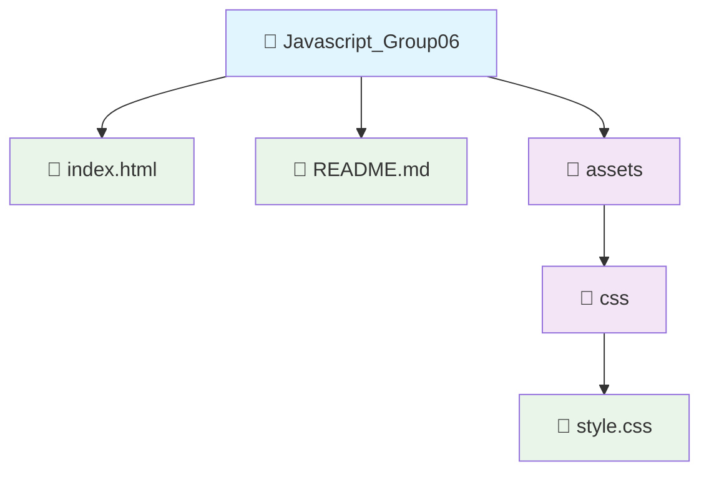

# Aplicación Web del Grupo 06

## ¿Qué es este proyecto?

Esta es una aplicación web simple desarrollada por el Grupo 06 como parte del curso de JavaScript. La aplicación muestra una página web básica con un encabezado personalizado que incluye el nombre del usuario.

## ¿Para qué sirve?

La aplicación tiene como objetivo:
- Demostrar los conceptos básicos de desarrollo web
- Mostrar cómo se puede personalizar una página web con JavaScript
- Servir como ejemplo de una estructura web bien organizada

## ¿Qué puedes ver en la aplicación?

Cuando abras la aplicación en tu navegador, verás:
- Un encabezado azul claro con el título de la aplicación
- El nombre del usuario mostrado en la esquina superior derecha
- Un mensaje de bienvenida
- Un pie de página con información de derechos reservados

## ¿Cómo usar la aplicación?

1. **Abrir la aplicación**: Simplemente haz doble clic en el archivo `index.html` para abrirlo en tu navegador web favorito (Chrome, Firefox, Safari, etc.)

2. **Visualizar el contenido**: La página se cargará automáticamente y podrás ver todo el contenido

3. **Navegar**: Aunque es una página simple, puedes explorar todos los elementos visuales

## Estructura del proyecto

El proyecto está organizado de manera sencilla y ordenada. Aquí puedes ver cómo están distribuidos los archivos:

### Descripción de cada archivo:

- **📄 `index.html`**: La página principal que ves cuando abres la aplicación en tu navegador
- **📄 `README.md`**: Este archivo que estás leyendo ahora, con toda la información del proyecto
- **📁 `assets/`**: Carpeta que contiene todos los recursos adicionales (estilos, imágenes, etc.)
- **📁 `css/`**: Subcarpeta dentro de assets que contiene los archivos de estilo
- **📄 `style.css`**: El archivo que controla cómo se ve la página (colores, tamaños, posiciones, etc.)

## ¿Quién desarrolló esto?

Este proyecto fue creado por el **Grupo 06** como parte de su aprendizaje en desarrollo web con JavaScript.

## Información adicional

- **Año**: 2026
- **Ubicación**: Perú
- **Tecnologías utilizadas**: HTML, CSS y JavaScript (lenguajes de programación web)

---

*Si tienes alguna pregunta sobre este proyecto, no dudes en contactar al Grupo 06.*